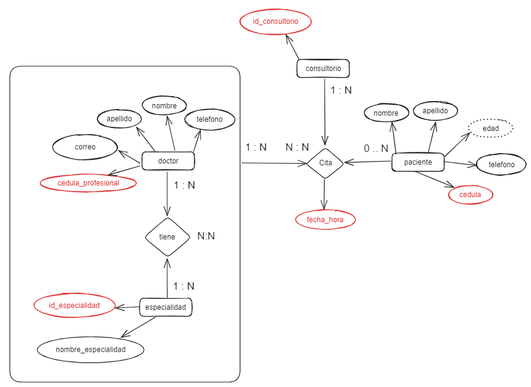

# eps-udistrital-express

## ¿Qué contiene este repositorio?
Aquí puedes encontrar un ejemplo de API REST para una EPS en donde se gestionan pacientes, doctores y citas.

El proyecto hace parte del curso de backend intermedio de la Universidad Distrital en convenio con ATENEA.

## Tecnologías usadas:

- [Node.js](https://nodejs.org/)
- [Express](https://expressjs.com/es/)
- [TypeScript](https://www.typescriptlang.org/)
- [Sequelize](https://sequelize.org/)
- [MySQL](https://dev.mysql.com/doc/)

## Modelo Entidad Relación (MER)


## Ejecutar el proyecto

### 1. Clonamos el repositorio usando estos comandos en la terminal:

```
git clone https://github.com/Davida4200/eps-udistrital-express.git
cd eps-udistrital-express/
```

### 2. Instalación de dependencias:
```
npm install
```

### 3. Crear el archivo .env:
```
touch .env
```
> **Nota:** También puedes crear el archivo manualmente

Ahora, debes poner tus credenciales en el archivo:
```
HOST=
PORT=
USERNAME=
PASSWORD=
DATABASE=
DATABASE_PORT=
```

### 4. Ejecutar el proyecto:
```
npm run dev
```

### 5. Importar la colección de postman:
En la carpeta raíz del repositorio se encuentra el archivo `citas-express.postman_collection.json`.
Este archivo debes importarlo en tu postman y tendrás la colección base de esta API, recuerda que se trabaja con **Mysql** con llaves foráneas, por lo que debes crear primero ***pacientes, doctores, especialidades y consultorios***, luego ***doctor_especialidad y citas***.

## Endpoints disponibles:

### Endpoint de Pacientes:

- `GET` - `api/pacientes/`: Obtiene todos los pacientes.
- `GET` - `api/pacientes/:id`: Obtiene un paciente específico por ID.
- `POST` - `api/pacientes/`: Crea un nuevo paciente.
- `PUT` - `api/pacientes/:id`: Actualiza un paciente existente.
- `DELETE` - `api/pacientes/:id`: Elimina un paciente existente.

### Endpoint de Doctores:

- `GET` - `api/doctores/`: Obtiene todos los doctores.
- `GET` - `api/doctores/:id`: Obtiene un doctor específico por ID.
- `POST` - `api/doctores/`: Crea un nuevo doctor.
- `PUT` - `api/doctores/:id`: Actualiza un doctor existente.
- `DELETE` - `api/doctores/:id`: Elimina un doctor existente.

### Endpoint de Especialidades:

- `GET` - `api/especialidades/`: Obtiene todas las especialidades.
- `GET` - `api/especialidades/:id`: Obtiene una especialidad específica por ID.
- `POST` - `api/especialidades/`: Crea una nueva especialidad.
- `PUT` - `api/especialidades/:id`: Actualiza una especialidad existente.
- `DELETE` - `api/especialidades/:id`: Elimina una especialidad existente.

### Endpoint de Consultorios:

- `GET` - `api/consultorios/`: Obtiene todos los consultorios.
- `GET` - `api/consultorios/:id_consultorio`: Obtiene un consultorio específico por ID.
- `POST` - `api/consultorios/`: Crea un nuevo consultorio.
- `PUT` - `api/consultorios/`: Actualiza un consultorio existente.
- `DELETE` - `api/consultorios/:id_consultorio`: Elimina un consultorio existente.

### Endpoint de Relación Doctor-Especialidad:

- `GET` - `api/doc-esp/`: Obtiene todas las relaciones entre doctores y especialidades.
- `GET` - `api/doc-esp/get-one`: Obtiene una relación específica entre doctor y especialidad.
- `POST` - `api/doc-esp/`: Crea una nueva relación entre doctor y especialidad.
- `PUT` - `api/doc-esp/`: Actualiza una relación entre doctor y especialidad existente.
- `DELETE` - `api/doc-esp/`: Elimina una relación entre doctor y especialidad existente.

### Endpoint de Citas:

- `GET` - `api/citas/`: Obtiene todas las citas.
- `GET` - `api/citas/one-cita`: Obtiene una cita específica por ID.
- `GET` - `api/citas/by-paciente`: Obtiene citas por paciente.
- `GET` - `api/citas/by-doctor`: Obtiene citas por doctor.
- `POST` - `api/citas/`: Crea una nueva cita.
- `PUT` - `api/citas/`: Actualiza una cita existente.
- `DELETE` - `api/citas/`: Elimina una cita existente.

## Probando la API
Puedes ver como se hace la prueba de la API en este [link](#).
> **Nota:** Falta añadir el video de pruebas.